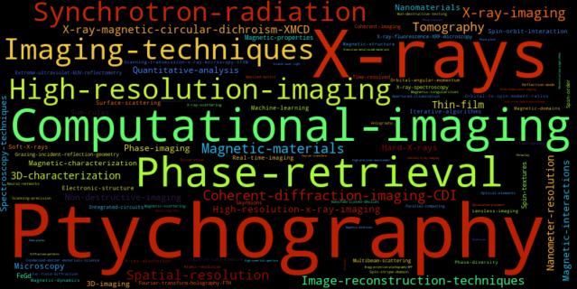

# Zotero Automation

A Python tool for analyzing Zotero library tags using AI categorization and visualization. Use at your own risk. 

## Features

- Extract and analyze tags from Zotero SQLite database
- AI-powered tag categorization using OpenAI API
- Generate word clouds from tags
- Export categorized tags in Obsidian markdown format
- Save unique tags for further analysis

## Installation

1. Clone the repository:
```bash
git clone https://github.com/gnzng/zotero_automate.git
cd zotero_automate
```

2. Install dependencies:
```bash
pip install -r requirements.txt
```

3. Set up environment variables:
```bash
cp .env-example .env
# Edit .env with your actual values
```

you need the the following variables:
- `ZOTERO_DB_PATH`: Path to your Zotero SQLite database
- `CBORG_API_KEY`: Your OpenAI API key
- `CBORG_BASE_URL`: OpenAI API base URL
- `CBORG_MODEL`: OpenAI model name to use

You can probably use other providers, like in my case [https://cborg.lbl.gov/](https://cborg.lbl.gov/) api URL, which uses the `openai` module for communication.

## Usage

Make sure zotero is closed, since we need database access. Run the main analysis:
```bash
python main.py
```

You should be able to uncomment or comment the things you would like to run your analysis on. 


## Output Files

- `unique_tags.txt`: List of unique tags from your library
- `categorized_tags.md`: AI-categorized tags in markdown format, that works great to include in obsidian
- Word cloud visualization (displayed)

## Contributing

Please feel free to open a PR or issue, I am looking forward to feedback.
